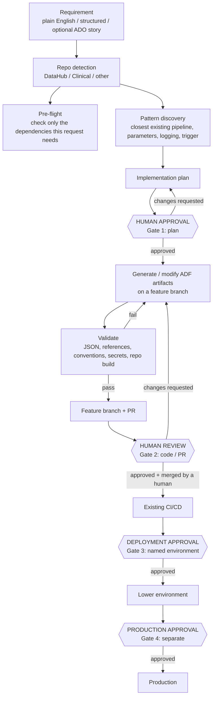
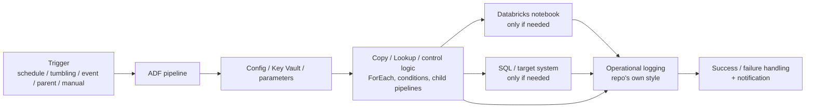

# GMR ADF Pipeline Skill

A reusable GitHub Copilot skill for building and changing Azure Data Factory (ADF) pipelines safely in any GMR ADF repository.

## Key points

- **An ADO story is optional.** You can describe the pipeline in plain English, give structured requirements, or point to an ADO story.
- **It adapts to the repository.** The skill detects whether you are working in **DataHub**, **Clinical**, or another ADF repo. It learns that repo's parameter names, logging, triggers, linked services, and architecture from its existing pipelines. It does not force one convention everywhere.
- **Prerequisites are checked automatically.** Before planning, the skill works out which connections this request needs and checks only those. It reuses connections you already have.
- **Not every pipeline needs Databricks or SQL.** They are checked only when the pipeline actually uses them.
- **People approve the important steps.** Nothing is generated before you approve the plan. Nothing is merged automatically. Nothing is deployed without explicit approval. Production always needs its own separate approval.

## How to use it

Open the target ADF repository in VS Code, open Copilot Chat in **Agent** mode, and ask in plain language.

**Example 1 - new pipeline**

```text
Create an ADF pipeline that reads data from <source>, calls Databricks notebook <notebook>, and runs daily.
```

**Example 2 - modify an existing pipeline**

```text
Modify the existing <pipeline-name> pipeline to add <requirement>.
```

**Example 3 - from an ADO story (optional)**

```text
Use this ADO story as the requirements for an ADF implementation: <story ID>.
```

You can also paste a structured list of requirements (source, target, load type, schedule, notebook, logging, environment).

## Skill flow



The same lifecycle in text form:

```text
Requirement (prompt / structured / optional ADO story)
    -> Repo detection
    -> Pre-flight
  -> Pattern discovery
  -> Plan
  -> HUMAN APPROVAL (Gate 1)
  -> Generate
  -> Validate
  -> Feature branch + PR
  -> HUMAN REVIEW (Gate 2) -> merge by a human
  -> Existing CI/CD
  -> DEPLOYMENT APPROVAL (Gate 3) -> lower environment -> validation
  -> SEPARATE PRODUCTION APPROVAL (Gate 4) -> production
```

## Technical reference architecture



> **This is a reference architecture, not a mandatory fixed pattern.** Each pipeline uses only the components its requirements and its repository's existing patterns call for. Many pipelines have no Databricks step, no SQL step, or no trigger (for example, child pipelines called by a parent).

## How the skill picks a pattern

The skill chooses a reference in this priority order:

1. the existing pipeline being modified;
2. pipelines in the same target repo;
3. pipelines in the same domain/family (DataHub or Clinical);
4. other GMR ADF repos;
5. generic ADF best practice (stated explicitly when used).

From the chosen reference, it discovers the parameter names, logging style, trigger pattern, linked services, Databricks usage, load pattern, and orchestration shape.

DataHub patterns it checks for in the target repo include control-table/metadata-driven orchestration, parent/child pipelines, incremental/full/snapshot loads, configuration and Key Vault references, ADF LiteLog/operational logging, Databricks notebook contracts, and scheduled/event/tumbling triggers. These are discovery targets, not mandatory components: the skill uses only patterns confirmed in the target repo and relevant to the request. If an existing framework fits, it extends that framework rather than building a new pipeline.

Clinical patterns are used for Clinical work only and are never forced onto DataHub; DataHub patterns are likewise never forced onto Clinical. Details: [references/repo-detection-and-patterns.md](references/repo-detection-and-patterns.md).

## Prerequisites (checked automatically)

There is **no universal requirement** to configure Databricks or SQL.

| Requested work | Needed |
|---|---|
| ADF-only source change | GitHub access to the target ADF repo |
| ADF calling Databricks | + an existing authenticated Databricks profile |
| ADF reading/writing SQL | + an existing saved SQL connection |
| Secrets via Key Vault | + access through existing linked services (secret values are never read) |
| Runtime verification / deployment | + Azure access and the repo's existing CI/CD workflow |
| Working from an ADO story | + Azure DevOps access (MCP or CLI) |

If something required is missing, the skill tells you exactly what is missing and stops. It never invents servers, environments, notebook paths, linked services, or credentials.

## Human approval gates

| Gate | When | What you see |
|---|---|---|
| 1 - Plan approval | Before anything is generated | Detected repo, closest reference pipeline(s), architecture, parameters, logging, trigger, files to create/change |
| 2 - Code/PR review | After generation and validation | Files changed, validation results, git diff, branch/PR information. No automatic merge. |
| 3 - Deployment approval | Before any deployment | What is deployed, target environment, deployment mechanism, affected resources |
| 4 - Production approval | Before production | A separate PRODUCTION approval, never inferred from lower environments |

GitHub stays the source of truth: **feature branch -> PR -> merge -> existing CI/CD -> deployment.** The skill never commits to `main` and never changes a runtime environment in a way GitHub doesn't reflect.

## Visible run log

Every run shows a status log, for example:

```text
ADF SKILL RUN LOG
[0] Scope classified: ADF + Databricks
[1] Pre-flight: PASS
    - GitHub repo: PASS
    - Databricks: PASS
    - SQL: NOT REQUIRED
    - ADO: NOT REQUIRED
    - Azure runtime: NOT REQUIRED yet
[2] Target repo: <repo> (DataHub)
[3] Reference pattern: <pipeline> (priority 2 - same repo)
[4] Requirements: COMPLETE
[5] Implementation plan: READY
[6] GATE 1 - Plan approval: WAITING
[7] Artifact generation: NOT STARTED
...
[10] GATE 3 - Deployment: NOT AUTHORIZED
[11] GATE 4 - Production: NOT AUTHORIZED
```

## Files in this skill

- [SKILL.md](SKILL.md) - the instructions Copilot follows.
- [references/checkpoints-and-approvals.md](references/checkpoints-and-approvals.md) - status values and approval prompts.
- [references/repo-detection-and-patterns.md](references/repo-detection-and-patterns.md) - repo detection and pattern discovery.
- [references/observed-gmr-patterns.md](references/observed-gmr-patterns.md) - patterns observed in a Clinical ADF snapshot (evidence, not a standard).
- [examples/example-run.md](examples/example-run.md) - an illustrative run.
- [tests/test-cases.md](tests/test-cases.md) - 20 acceptance test scenarios.

## Scope

This skill covers ADF work: pre-flight, repo detection, pattern discovery, planning, ADF JSON and trigger generation/modification, validation, feature branch + PR, and governed deployment hand-off. It does not write Databricks notebook logic or create ADO stories; those belong to other skills.
